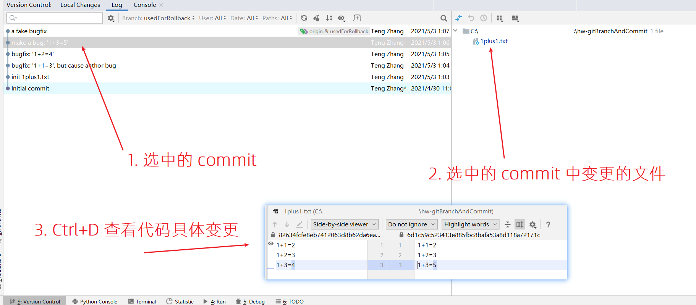

# hw-gitBranchAndCommit
homework: practice for git branch and commit.

### 前置知识
实践本 homework 之前：
* 请先完成 [hw-githubForkAndIssue](https://github.com/SDUOJ-Team/hw-githubForkAndIssue)。
* 请自行在你的操作系统上安装 Git 命令行工具，并确保在你的命令行执行 `git --version` 能输出所安装 Git 的版本
* 熟知一些基本的 Git 知识，包括但不限于 Git Branch、Git 工作区与暂存区、Git Commit 的查看与提交、Git push

### 本次 HW
本次 homework 是一些关于 `Git&Github` 的知识，在此，你将通过实践逐步学习以下知识：

1. Github Repo 的 Clone
2. Git Branch 的查看与切换
3. Git Branch 的新建
4. Git 工作区与暂存区
5. Git Commit 的提交
6. Git Push

### 开始之前

1. Fork 当前 Repo 到你的账户之下，从现在开始这个 fork 出来的 Repo 将在下文中被称为 "你的 Repo"
2. 执行 `git clone https://github.com/你的用户名/hw-gitBranchAndCommit` 将你 fork 的仓库 clone 到本地

### hw1

步骤：
1. 在命令行中进入你的 Repo 的路径
2. 使用 `某个 git 命令` 查看当前 repo 中有哪些 branch
3. 找那个名字最长的 branch，随后*使用某个 git 命令*将当前分支切换到那个 branch
4. 在当前 branch 中有一个文件 `1plus1.txt`，打开它，并修改里面的等式错误
5. 现在你对文件 `1plus1.txt` 做出了修改，请尝试使用 `git status` 查看当前 "工作区 working diretory" 中有哪些文件产生了变更
6. 使用 `某个 git 命令` 将 "工作区“ 中 `1plus1.txt` 加入到 "变更区" 中
7. 使用 `git commit -m "一些合适的描述"` 将 "变更区" 中的变更提交成一个 commit，并对该 commit 做一些合适的描述（比如 "fix the equation in 1plus1.txt"）
8. 使用 `git push` 将当前分支的变更 push 到你的 Repo

OK，现在你完成了 hw1，你现在需要对母仓库提交一个 issue 来检验你的 Repo 是否正确，issue 模板请选择 "Submit hw1"

### hw2

步骤：
1. 在命令行中进入你的 Repo 的路径
2. 切换到 `usedForRollback` 分支
3. 使用 `某个 git 命令` 查看当前 Git Commit 历史，大概会看到如下的信息：
   ```
    commit 9b872821027c78f4f2f9d287c53b3ece576f18c8 (HEAD -> usedForRollback, origin/usedForRollback)
    Author: Teng Zhang <zhangt2333@gmail.com>
    Date:   Mon May 3 01:07:25 2021 +0800
    
        a fake bugfix
    
    commit 6d1c59c523413e885fbc8bafa53a8d118a72171c
    Author: Teng Zhang <zhangt2333@gmail.com>
    Date:   Mon May 3 01:06:36 2021 +0800
    
        make a bug: '1+3=5'
    
    commit 82634fcfe8eb7412063d8b62da6ea705da50c0d7
    Author: Teng Zhang <zhangt2333@gmail.com>
    Date:   Mon May 3 01:05:31 2021 +0800
    
        bugfix: '1+2=4'
    
    commit 096e01471ad4567c4bbe0b9f43fc2e71ba42d21c
    Author: Teng Zhang <zhangt2333@gmail.com>
    Date:   Mon May 3 01:04:46 2021 +0800
    
        bugfix: '1+1=3', but cause anthor bug
    
    commit ba5de0f6446c8c62d19187ae78fb8cc738036a13
    Author: Teng Zhang <zhangt2333@gmail.com>
    Date:   Mon May 3 01:03:49 2021 +0800
    
        init 1plus1.txt
    
    commit 94e50c9c3320c52dcd58929eff536581005efd04
    Author: Teng Zhang <zhangt2333@gmail.com>
    Date:   Fri Apr 30 11:08:29 2021 +0800
    
        Initial commit
    (END)
   ```
4.  你也可以使用 JetBrains IDE 中的 "VCS (Version Control System)" 来查看上述的历史，并选中某个或某些 commit 用 Ctrl+D 来查看这 commit 变更的文件内容 

5. 现在需要回滚到最近的没有 Bug 的版本。请使用 `某个 git 命令` 将 HEAD 指针回退到一个正常没有 Bug 的 Commit 节点，即使得 Git Commit 历史变成如下：
   ```
    commit 82634fcfe8eb7412063d8b62da6ea705da50c0d7
    Author: Teng Zhang <zhangt2333@gmail.com>
    Date:   Mon May 3 01:05:31 2021 +0800
    
        bugfix: '1+2=4'
    
    commit 096e01471ad4567c4bbe0b9f43fc2e71ba42d21c
    Author: Teng Zhang <zhangt2333@gmail.com>
    Date:   Mon May 3 01:04:46 2021 +0800
    
        bugfix: '1+1=3', but cause anthor bug
    
    commit ba5de0f6446c8c62d19187ae78fb8cc738036a13
    Author: Teng Zhang <zhangt2333@gmail.com>
    Date:   Mon May 3 01:03:49 2021 +0800
    
        init 1plus1.txt
    
    commit 94e50c9c3320c52dcd58929eff536581005efd04
    Author: Teng Zhang <zhangt2333@gmail.com>
    Date:   Fri Apr 30 11:08:29 2021 +0800
    
        Initial commit
    (END)
   ```
6. 回退之后，将当前分支使用 `git push` push 到你的 Repo 试试，看看会不会报错
7. 报错是正常的，因为你的 Repo 本地的当前分支 (usedForRollback) 和远端分支并不是父子关系，此时如果想要回退远端的 commit，就只能使用 `git push --force` 来强制 push。请记住：
    * ！永远不要在公共 Branch 上使用 force push
    * ！永远不要在和别人共享的 Branch 上使用 force push
    * ！你可以在你自己独有的 Branch 上使用 force push，但请知道为什么非得用 force
    
OK，现在你完成了 hw2，你现在需要对母仓库提交一个 issue 来检验你的 Repo 是否正确，issue 模板请选择 "Submit hw2"
